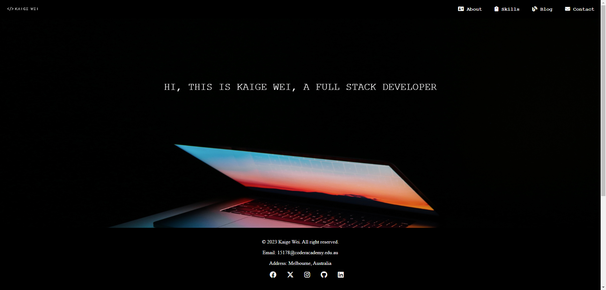

# My Portfolio
Hi, I'm Kaige Wei, an aspiring and enthusiastic full stack developer with strong passion for web design and developing. Focus on website development with problem-solving techniques and soild software engineering functions in multiple programming languages. Eager to cooperate and contribute to team works.

## Links
* __Website:__ https://gorgeous-sprinkles-2694f4.netlify.app/
* __Github:__ https://github.com/Kaige-Wei-425/WKG_Portfolio
* __Presentation Video:__ https://youtu.be/9EUxI7v-3UQ

## Purpose
### Why Explore My Portfolio?
* __Know About Me__: Konw my personalities and my hobbies.
* __Technical Proficiency__: Deive into the span of my technical skills across the full stack development. 
* __My Growth__: Read through my blog where I document my journey.
* __Contact With Me__: Whether you are looking for a developer to join your team, my contact details are just click away.

## Functionalities
* __Image Gallery__: Browse the images of my two little cats with animation applied.
* __Responsive Design__: Ensures a seamless experience across various devices with multiple screen sizes.
* __Downloadable Resume__: Option to view and download my resume as PDF.
* __Contact Form__: A way for you to directly through the website.
* __Social Media__: Option to view and connect to my social media.

## Sitemap

## Screenshots
### Home

### About

### Skills

### Blog

### Contact

## Target Audience
* __Potential Employer__
* __Collaborators and Partners__
* __Tech Community__
* __Networking Opportunities__

## Tech Stack
* __HTML__
* __CSS__
* __SASS__
* __Javascript__